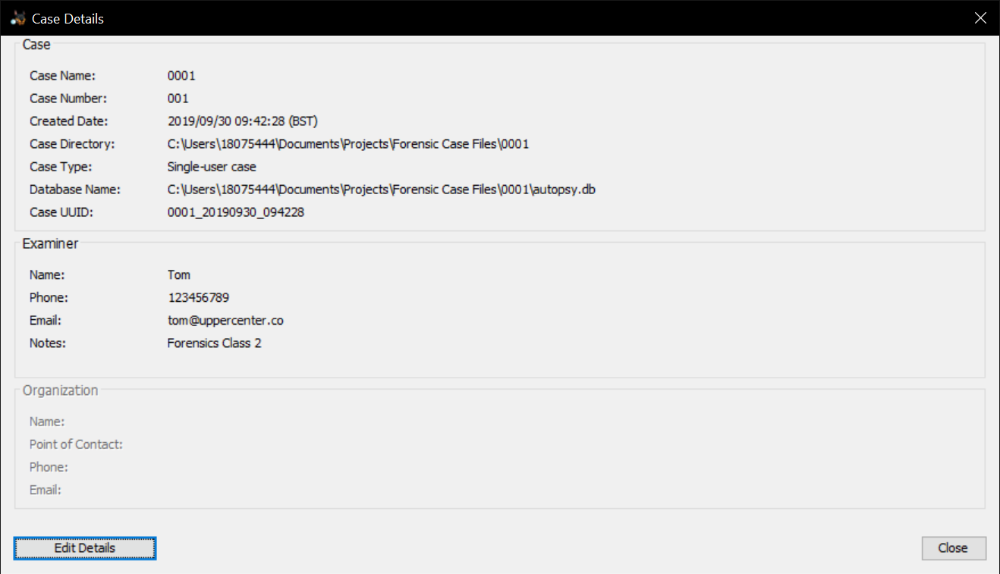

# Contemporaneous Notes

**Contents**

- [Contemporaneous Notes](#contemporaneous-notes)
  - [What could they be used for?](#what-could-they-be-used-for)
  - [Contemporaneous notes can include:](#contemporaneous-notes-can-include)
  - [Preparing Evidence](#preparing-evidence)
- [Task "Mantooth"](#task-%22mantooth%22)
    - [Additional Case Information:](#additional-case-information)
    - [Case Details](#case-details)
    - [File Hash Information](#file-hash-information)
    - [File Information / Statistics](#file-information--statistics)
    - [Internet Statistics](#internet-statistics)
    - [Installed Applications](#installed-applications)
    - [Investigator Signature:](#investigator-signature)

What are contemporaneous Notes?

> Defined as an accurate record, made at the time, or as soon after the event as practicable.
> It is a record of relevant evidence which is seen, heard or done, by the maker of the note.

They Could be:
* Written
* Recorded electronically
* Digital
* Audio
* May be used a primary source of evidence

## What could they be used for?
* Legal cases
* Notes taken at time of interviewing individuals.
* Telephone calls and visits to premises.

## Contemporaneous notes can include:
1. Notebooks
2. Diaries
3. Minutes
4. File notes/running sheets
5. Photographs and video can be used to support contemporaneous notes. 
6. Software is now being introduced to hold all contemporaneous notes, EG [Lima](https://www.intaforensics.com/lima/) Software

## Preparing Evidence
* Do not overwrite evidence, any updates.
* Do not write between lines.

---

# Task "Mantooth"

Case overview:
* Case ID: 001
* Examiner Name: Tom Hindby
* Start Time: 09:43:35AM
* Start Date: Monday 30th September 2019
* Application Name: Autopsy
* Software Version: 4.12.0

### Additional Case Information:
- Browsers Detected
  * Chrome: Not Found.
  * FireFox: Not Found.
  * Safari: Not Found.
  * Internet Explorer: Found.

- Disk Information:
  * Disk Size (Bytes):	128450048
  * Device ID:	`1b94da6a-230c-456c-be4e-4c5c98ae35ef`
  * Sector Size (Bytes):	512
  * Logical Volumes: 4

- Additional Information:
  * Timezone:	Europe/London
  * Email Addresses: 327
  * Kernel: Windows NT
  * Operating System: Windows Vista x86

### Case Details




### File Hash Information

```
Created By AccessData™ FTK™ Imager 2.5.3.14 071018

Case Information:
Case Number:  
Evidence Number:  
Unique Description: 
Examiner:  
Notes:  

--------------------------------------------------------------
Information for C:\Documents and Settings\Ken\Desktop\ADSHARE\Mantooth32:

Physical Evidentiary Item (Source) Information:
[Drive Geometry]
 Cylinders: 15
 Tracks per Cylinder: 255
 Sectors per Track: 63
 Bytes per Sector: 512
 Sector Count: 250,879
[Physical Drive Information]
 Drive Model: SanDisk Cruzer Mini USB Device
 Drive Interface Type: USB
 Source data size: 122 MB
 Sector count:    250879
[Computed Hashes]
 MD5 checksum:    31217210a1a69f272079a3bde3d9d8fc
 SHA1 checksum:   12e4ac047e328ca2bd63a4d65df25b3ecba55769

Image Information:
 Acquisition started:   Wed Jul 02 15:09:34 2008
 Acquisition finished:  Wed Jul 02 15:09:54 2008
 Segment list:
  C:\Documents and Settings\Ken\Desktop\ADSHARE\Mantooth32.E01

Image Verification Results:
 Verification started:  Wed Jul 02 15:09:54 2008
 Verification finished: Wed Jul 02 15:09:55 2008
 MD5 checksum:    31217210a1a69f272079a3bde3d9d8fc : verified
 SHA1 checksum:   12e4ac047e328ca2bd63a4d65df25b3ecba55769 : verified
```
This image has been verified to be correct.

---

Autopsy Verified Hash Information:
```
Data Source Verification Results for Mantooth.E01
Result: verified
MD5 hash verified
Calculated hash: 31217210a1a69f272079a3bde3d9d8fc
Stored hash: 31217210a1a69f272079a3bde3d9d8fc
```
---

### File Information / Statistics

- File Information
  - Total Files Processed 2998

| File Type | File Extensions | Detected Files
| ------ | ------ |------ |
| Archives |`.zip, .rar, .7zip, .7z, .arj, .tar, .gzip, .bzip, .bzip2, .cab, .jar, .cpio, .ar, .gz, .tgz, .bz2` | 5 |
| Audio |`.aiff, .aif, .flac, .wav, .m4a, .ape, .wma, .mp2, .mp1, .mp3, .aac, .mp4, .m4p, .m1a, .m2a, .m4r, .mpa, .m3u, .mid, .midi, .ogg` | 2 |
| Databases |.`db, .db3, .sqlite, .sqlite3g` | 12 
| Images |`.jpg, .jpeg, .png, .psd, .nef, .tiff, .bmp, .tec, .tif` | 407
| Videos |`.aaf, .3gp, .asf, .avi, .m1v, .m2v, .m4v, .mp4, .mov, .mpeg, .mpg, .mpe, .mp4, .rm, .wmv, .mpv, .flv, .swf`| 8
| Executable Files |`.exe, .dll` | 10

---
<br>

### Internet Statistics

| Internet Hits | Quantity
| ------ | ------ |
`index.dat` | 374

---
<br>

### Installed Applications

| Program Name |Instalation Time & Data |
| ------ | ------ |
WebEx	| 2007-10-10 10:12:40 BST
Microsoft Office Standard Edition 2003 v.11.0.5614.0	|	2007-04-17 23:25:28 BST
RTC Client API v1.2 v.1.2.0000	|	2007-04-17 21:43:27 BST
AccessData DNA 3 Worker v.3.3	|	2007-04-17 19:58:46 BST
AccessData Registry Viewer v.1.5	|	2007-04-14 00:01:22 BST
QuickTime	|	2007-04-13 23:36:51 BST
Adobe Reader 8 v.8.0.0	|	2007-04-12 23:26:59 BST
VNC Free Edition 4.1.2 v.4.1.2	|	2007-04-11 17:24:00 BST
TrueCrypt	|	2007-04-11 01:37:31 BST
Mozilla Firefox (2.0.0.3) v.2.0.0.3 (en-US)	|	2007-04-10 17:55:21 BST
AccessData FTK Imager v.2.5.1	|	2007-02-27 23:14:26 GMT
BestCrypt 8.0	|	2007-02-27 23:08:21 GMT
P2P Networking	|	2007-02-27 23:03:51 GMT
Yahoo! Browser Services	|	2007-02-27 20:28:40 GMT
Yahoo! Install Manager	|	2007-02-27 20:28:40 GMT
Yahoo! Internet Mail	|	2007-02-27 20:28:36 GMT
Yahoo! Toolbar	|	2007-02-27 20:28:31 GMT
Yahoo! Toolbar	|	2007-02-27 20:28:29 GMT
Yahoo! Messenger	|	2007-02-27 20:28:14 GMT
WinRAR archiver	|	2007-02-27 20:01:25 GMT
Trillian	|	2007-02-27 19:39:25 GMT
Windows Live Messenger v.8.1.0178.00	|	2007-02-27 19:29:18 GMT
Viewpoint Media Player	|	2007-02-27 19:21:07 GMT
AIM 6	|	2007-02-27 19:21:04 GMT
AOLOCP_Y	|	2007-02-27 19:20:53 GMT
DXM_Runtime	|	2007-02-27 19:18:16 GMT
MPlayer2	|	2007-02-27 19:18:16 GMT
Adobe Flash Player 9 ActiveX v.9	|	2007-02-27 19:11:18 GMT
AddressBook	|	2006-11-02 12:51:44 GMT
Connection Manager	|	2006-11-02 12:51:44 GMT
DirectDrawEx	|	2006-11-02 12:51:44 GMT
Fontcore	|	2006-11-02 12:51:44 GMT
IE40	|	2006-11-02 12:51:44 GMT
IE4Data	|	2006-11-02 12:51:44 GMT
IE5BAKEX	|	2006-11-02 12:51:44 GMT
IEData	|	2006-11-02 12:51:44 GMT
MobileOptionPack	|	2006-11-02 12:51:44 GMT
SchedulingAgent	|	2006-11-02 12:51:44 GMT

### Investigator Signature:
<br>
<br>

---
