# Contemporaneous Notes

Device:
* IBM Travelstar HDD - Spinning Disk Drive
* 6GB Capacity
* Uses Old Connection Style IDE Standard

Heavy Damage To Device
* Internal Platter Shattered - No Way For Disk To Spin
* Manufactured in July 2000
* Serial Number: 12416/15/63
* Product Number: 31L9876

Procedure:
* Bag Was Signed - 10:34 
* Evidence Bag Was Opened - 10:34
* Device Was Removed From Evidence Bag - 10:35
* Brief Outer Device Inspection - 10:38
* Extensive Photographs Documented - 10:42

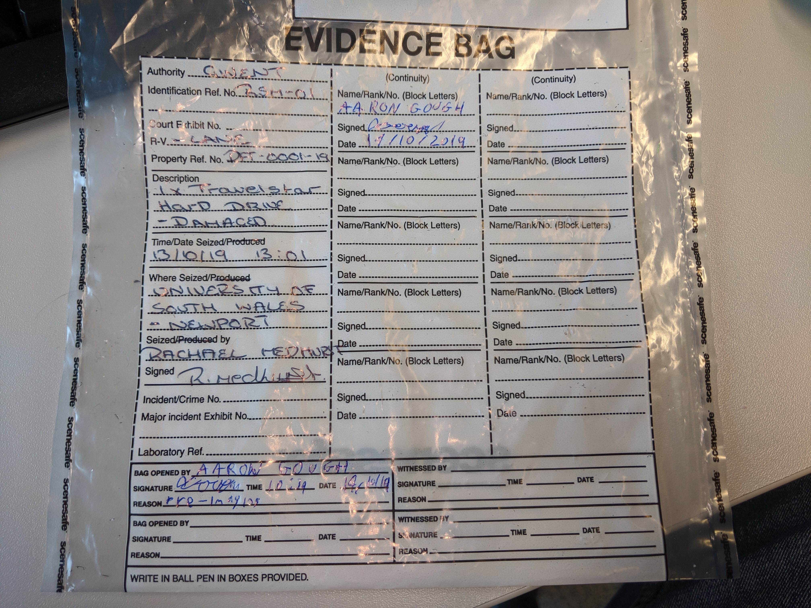

Description of Observed Damage:
* Rear PCB has significant indentation from blunt object at force.
* PCB Shattered in three places
* Inner Spinning Platter appears totally shattered
* Front Metal Plate Has Significant Dent 
* Overall Device Slightly Curved
* Fragment of platter underneath sticker potion

## Images of Device:

### Front of Hard Disk
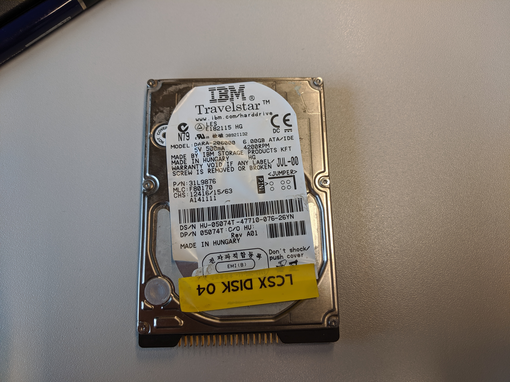

### Left Side of Hard Disk
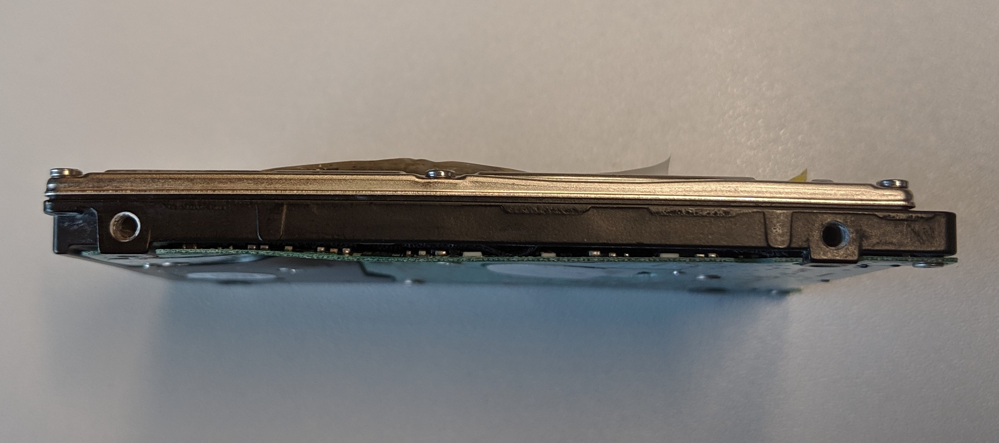

### Connectors
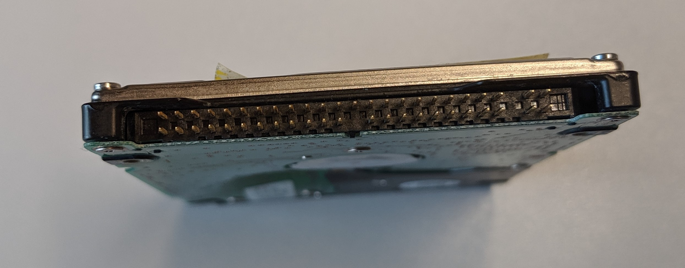

### Right Side
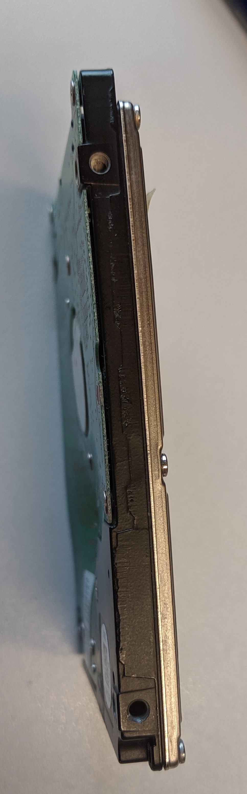

### Top Side
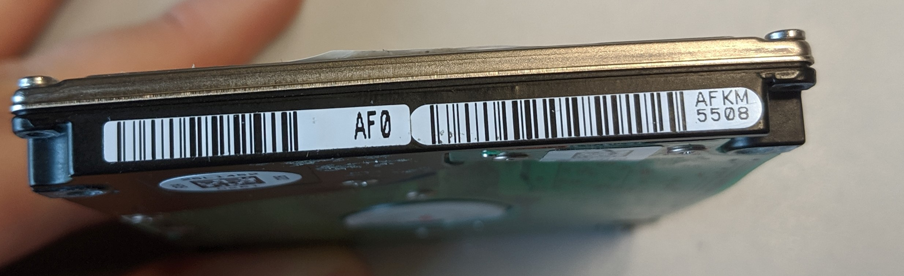

### Bottom PCB
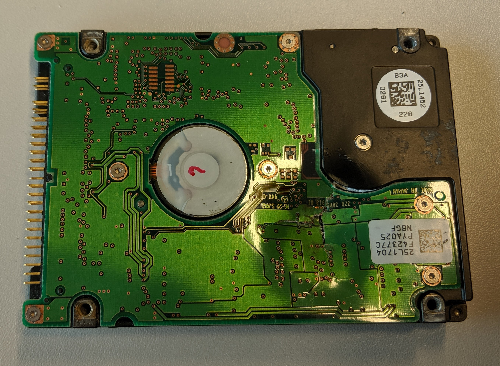

### Bottom PCB 2
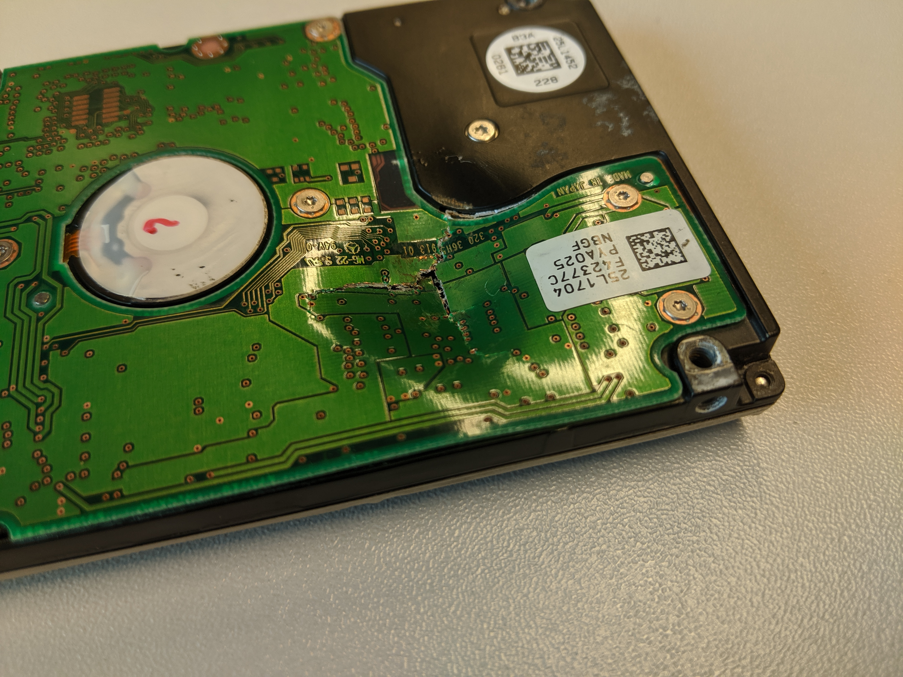

### Crack
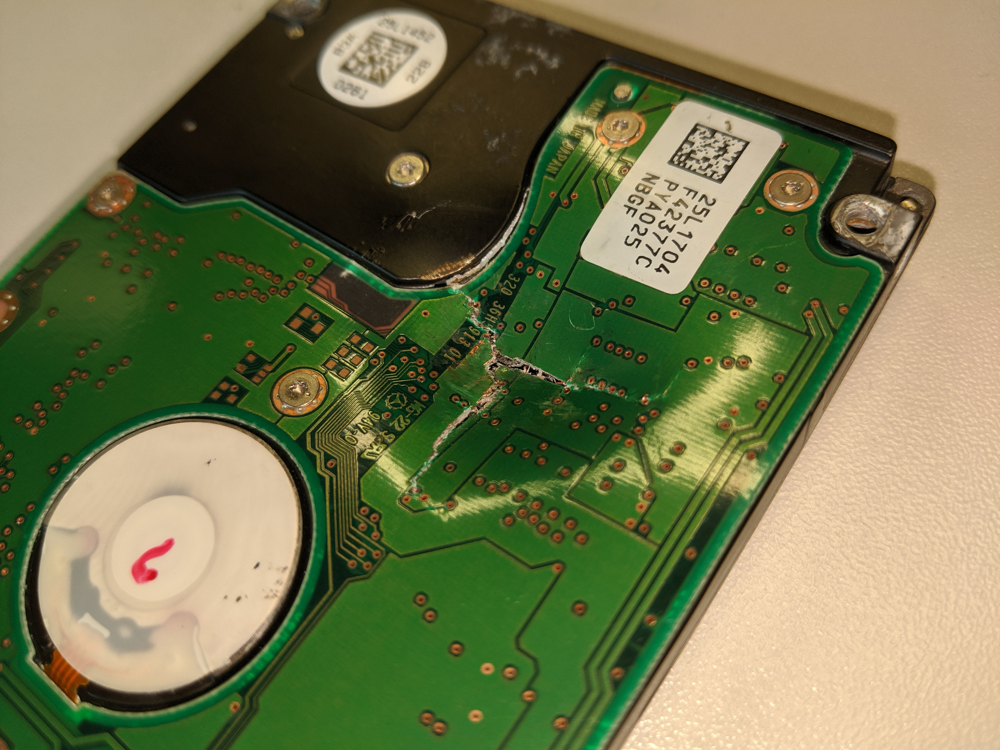

### Top Cover Information
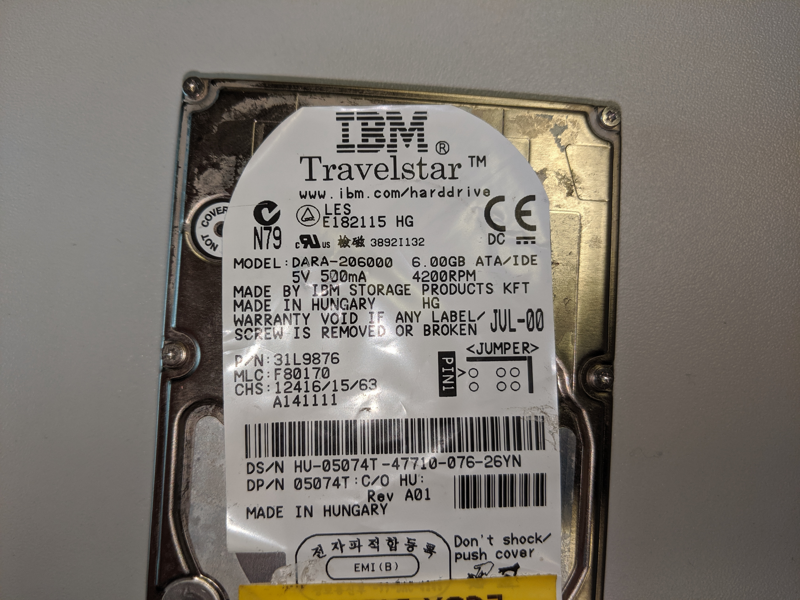

### Bottom Cover Information
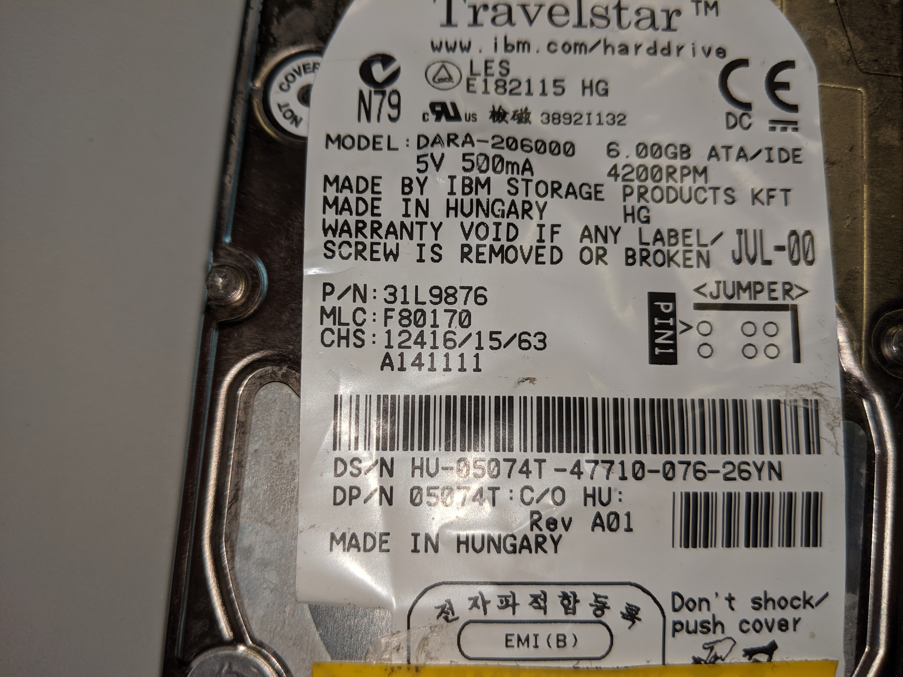

### Side View
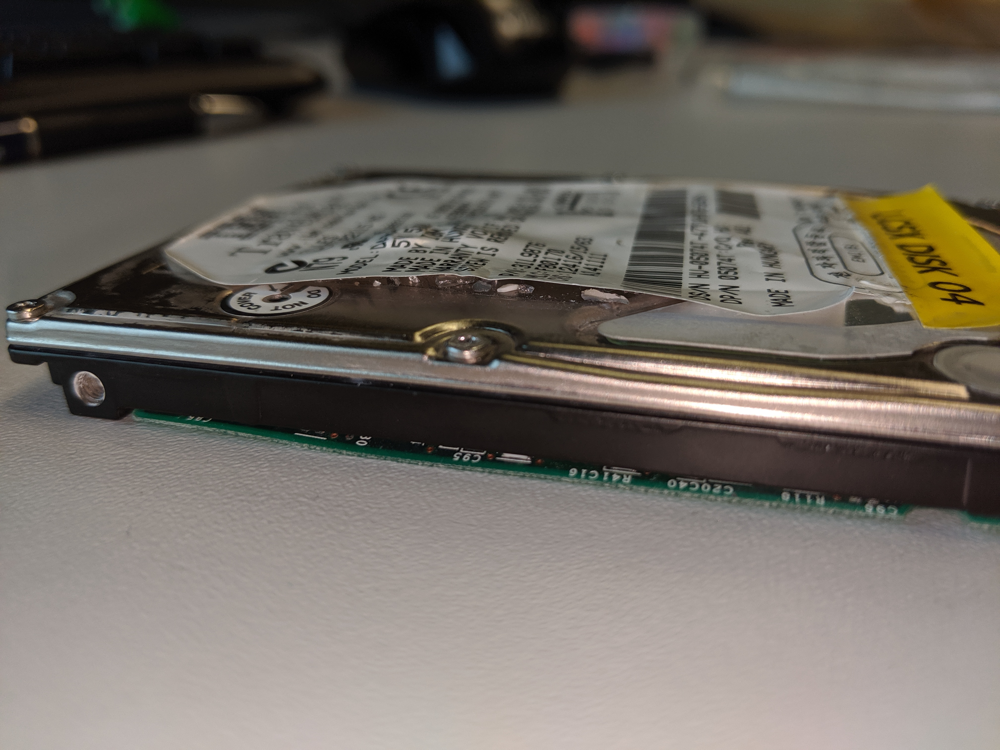

### QR Codes
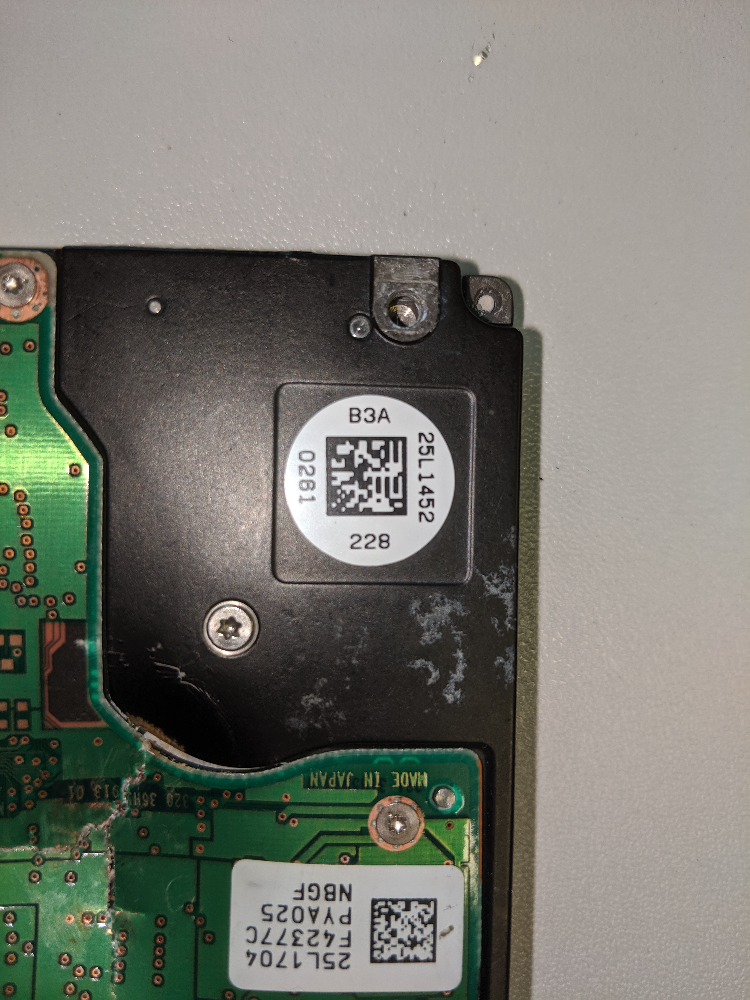